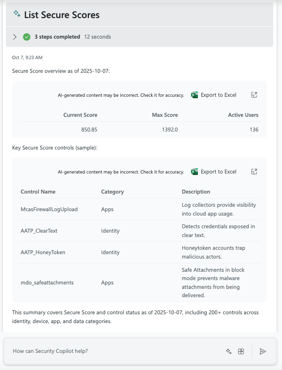

### SCP - [Defender XDR] Secure Score (Security Copilot Plugin)

**Purpose**
- Security Copilot cannot natively read Microsoft Secure Score, so this plugin exposes the Microsoft Graph Secure Score endpoint as a skill to retrieve score overviews and trends.

**Files**
- Plugin descriptor: `SCP - API - Defender XDR Secure Score Plugin.yaml`
- OpenAPI spec: `SCP - SPEC - Secure Score GraphAPI.yaml`

**Permissions**
- The Security Copilot app registration has the required Graph permission to access Secure Score: `SecurityEvents.Read.All` (least-privileged per Graph docs).

**API details**
- Endpoint: `GET https://graph.microsoft.com/v1.0/security/secureScores`
- The current spec uses `?$top=1` to retrieve the latest Secure Score details.
- Supported OData parameters: `$top`, `$skip`, `$count`, `$filter`.
- Important limitation: The endpoint does not support `$select`, so you cannot limit the fields returned in the payload. This makes it difficult to reduce response size or project just specific properties.

**Usage in Security Copilot**
- Skill name (OperationId): `List Secure Scores`

- Invoke by prompting with the skill name. No input parameters are required.

**SCU Consumption**
- It depends on the prompt and the output but tests show an average of 1 SCU. 

**Why this plugin**
- Security Copilot does not currently read Secure Score natively; this custom plugin leverages Graph to bridge that gap with minimal setup.
- Secure Score Control values can be use for Incident Root Cause analysis and Monitoring of the overall security Posture of the environment, among other use cases.

**References**
- Microsoft Secure Score overview: [learn.microsoft.com](https://learn.microsoft.com/en-us/defender-xdr/microsoft-secure-score)
- Graph API: List `secureScores`: [learn.microsoft.com](https://learn.microsoft.com/en-us/graph/api/security-list-securescores?view=graph-rest-1.0&tabs=http)
