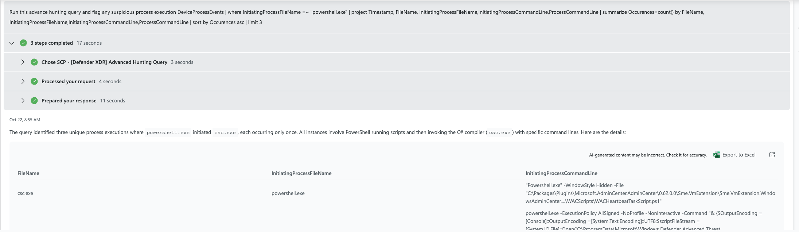
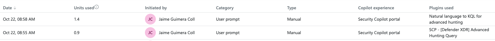

### SCP - [Defender XDR] Advanced Hunting (Security Copilot Plugin)

**Purpose**
- Execute exact Kusto Query Language (KQL) against Microsoft Defender for Endpoint’s Advanced Hunting directly from Security Copilot.
- Optimized for speed and Security Compute Unit (SCU) efficiency when you already know the KQL you want to run (e.g., testing a Custom KQL plugin or feeding a list of KQL hunts to a Security Copilot Agent).

> Efficiency note: Testing/research indicates this custom plugin is ~30% faster and more SCU‑efficient than the NL2KQL native skill for identical known queries because it bypasses NL→KQL translation and executes the KQL directly. Actual results may vary by query complexity, time range, and data volume.

**Files**
- Plugin descriptor: `SCP - API - Defender XDR Advanced Hunting Plugin.yaml`
- OpenAPI spec: `SCP - SPEC - Defender XDR Advanced Hunting API.yaml`

**Permissions**
- The Security Copilot app registration must include the Defender XDR permission for Advanced Hunting:
  - `AdvancedHunting.Read.All` (least‑privileged for read-only hunting).

**API details**
- Endpoint: `POST https://api.security.microsoft.com/api/advancedhunting/run`
- Request body: `{ "Query": "<your KQL here>" }`
- Time scoping: Include time filters inside your KQL (e.g., `| where Timestamp > ago(7d)`) to reduce scan scope and cost.
- Output: Tabular results with column metadata and row data.

**Usage in Security Copilot**
- Skill name (OperationId): `Run Advanced Hunting Query`
- Invoke by prompting with the skill name and providing the KQL string as the input parameter. No additional parameters are required unless your plugin descriptor defines them (e.g., optional limits).

**SCU Consumption**
- Depends on query complexity, time range, and output size.
- Observed results show ~30% lower SCU consumption compared to NL2KQL for the same known KQL, due to eliminating the NL→KQL translation overhead.

**Why this plugin**
- Deterministic execution: Your KQL runs as‑is, preserving exact filters, projections, and limits.
- Lower latency and cost for known queries: Ideal for automation and Agent workflows that batch curated KQL.
- NL2KQL note: The NL2KQL skill can modify the generated query and introduce additional uncertainty; use this plugin when you require exact, unchanged query semantics.

**References**
- Advanced hunting overview: [Microsoft Defender XDR advanced hunting](https://learn.microsoft.com/en-us/defender-xdr/advanced-hunting-overview)
- API: Run advanced hunting query: [Microsoft Defender XDR Advanced Hunting API](https://learn.microsoft.com/en-us/defender-xdr/advanced-hunting-query-language-api)
